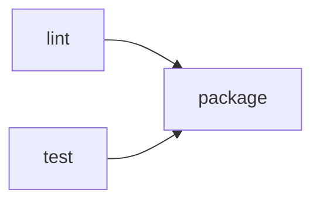

# Workflows

A workflow is a typed DAG of steps. Authors write the graph in HCL,
and Condukt compiles it to the canonical JSON document that the engine
executes, `condukt check` validates, and visual tools can read.

There is no project layout, manifest, or lockfile. To run a workflow
you point the engine at a `.hcl`, `.json`, `.yaml`, `.yml`, or `.exs`
path. The basename of the file is the run name unless the compiled
document carries an explicit `name`.

## A first workflow

`hello.hcl`:

```hcl
workflow "hello" {
  input "name" {
    type = "string"
  }

  cmd "greet" {
    argv = ["echo", "Hello, ${input.name}"]
  }

  output = task.greet.stdout
}
```

Run it with the standalone engine or with Mix:

```sh
condukt run hello.hcl --input '{"name":"world"}'
mix condukt.run hello.hcl --input '{"name":"world"}'
```

The resolved `output` expression is printed on stdout. Strings are
printed as is, other values are JSON-encoded.

## Why HCL

HCL gives workflow authors a purpose-built configuration language
instead of an embedded programming language. Blocks declare graph
nodes, `needs` declares edges, and references make data flow visible:

```hcl
workflow "checks" {
  cmd "lint" {
    argv = ["mix", "format", "--check-formatted"]
  }

  cmd "test" {
    argv = ["mix", "test"]
  }

  cmd "package" {
    needs = ["lint", "test"]
    argv = ["mix", "hex.build"]
  }

  output = {
    lint = task.lint.ok,
    test = task.test.ok,
    package = task.package.ok
  }
}
```

This graph has two independent roots, `lint` and `test`, followed by
`package`. A visualizer can draw it directly from the compiled JSON:



HCL intentionally makes dependencies stricter than raw JSON. When an
HCL step reads `task.<id>`, that step must also declare `<id>` in
`needs`. This keeps execution order and data dependencies visible in
the authored file:

```hcl
workflow "release_notes" {
  cmd "version" {
    argv = ["sh", "-c", "git describe --tags --always"]
  }

  agent "draft" {
    needs = ["version"]
    model = "openai:gpt-4.1-mini"
    input = "Draft release notes for ${task.version.stdout}"
  }

  output = task.draft.output
}
```

## The schema

The workflow document is validated against a published JSON Schema.
The canonical source lives in this repository at
`priv/schemas/condukt.workflow.schema.json` and is reachable on GitHub
at:

```text
https://raw.githubusercontent.com/tuist/condukt/main/priv/schemas/condukt.workflow.schema.json
```

The compiled JSON shape is:

```jsonc
{
  "name": "review-pr",            // optional, defaults to file basename
  "inputs": { ... },              // typed input map
  "steps": { "<id>": { ... } },   // map of step id to step definition
  "output": "<expression>"        // optional, what `condukt run` prints
}
```

A step has the shape:

```jsonc
{
  "kind": "cmd" | "agent" | "http" | "tool" | "map",
  "needs": ["other_step"],        // explicit dependencies
  "when": "<expression>"          // optional gate
}
```

JSON and YAML continue to accept implicit dependencies inferred from
`${steps.X.*}` references. HCL requires those dependencies to be
declared in `needs` as well.

## HCL syntax

The top level contains one `workflow "name"` block. Inputs are declared
with `input "id"` blocks, and steps are declared with kind blocks:

```hcl
workflow "deploy" {
  input "environment" {
    type = "string"
    enum = ["staging", "production"]
  }

  http "fetch_version" {
    method = "GET"
    url = "https://example.test/version"
    expect_status = 200
  }

  cmd "deploy" {
    needs = ["fetch_version"]
    when = input.environment == "production"
    argv = ["./scripts/deploy", task.fetch_version.body.version]
    env = {
      DEPLOY_ENV = input.environment
    }
  }

  output = {
    deployed = task.deploy.ok,
    version = task.fetch_version.body.version
  }
}
```

Inside HCL:

- `input.name` compiles to `${inputs.name}`.
- `task.fetch.body` compiles to `${steps.fetch.body}`.
- A bare HCL reference, such as `input.name`, preserves the referenced
  value's type.
- A string template, such as `"Hello, ${input.name}"`, interpolates the
  value into a string.

## Step kinds

- `cmd`: runs an executable on the host. Fields: `argv` (list of
  strings, required), `cwd` (optional), `env` (optional dict).
  Outputs: `stdout`, `exit_code`, `ok`.
- `agent`: runs an LLM-driven step. Fields: `model` (required),
  `input` (required, any), `tools` (optional list of tool ids),
  `system` (optional system prompt), `output_schema` (optional JSON
  Schema for structured output). Output: `output` and `ok`.
- `http`: deterministic HTTP call. Fields: `method`, `url`, `headers`,
  `body`, `expect_status`. Output: `status`, `headers`, `body`.
- `tool`: invokes a registered host tool by id. Fields: `id`, `args`.
  Output: `output` and `ok`.
- `map`: fan-out. Fields: `over` (expression resolving to a list),
  `as` (binding name), `do` (a nested step definition). Output: a list
  of the nested step's outputs in input order.

Example fan-out:

```hcl
workflow "summarize_files" {
  tool "glob" {
    id = "Glob"
    args = {
      pattern = "guides/*.md"
    }
  }

  map "summaries" {
    needs = ["glob"]
    over = task.glob.output
    as = "file"

    tool {
      id = "Read"
      args = {
        file_path = file
      }
    }
  }

  output = task.summaries
}
```

## Expressions

Expressions are evaluated against `inputs`, `steps`, and, inside a
`map` step, the `as` binding. HCL authors normally use the singular
aliases `input` and `task`; the compiler rewrites them to the canonical
expression roots.

Supported:

- Member access: `input.name`, `task.fetch.body.title`
- Indexing: `task.list.items[0]`, `obj["a key"]`, negative indices
- Comparisons: `==`, `!=`, `<`, `<=`, `>`, `>=`
- Boolean: `&&`, `||`, `!`
- Unary minus: `-1`, `xs[-1]`
- Literals: strings, numbers, booleans, null, parens
- Type-aware formatters in canonical expressions: `${var:json}`,
  `${var:csv}`

Not supported:

- Arbitrary function calls, regex, or arithmetic beyond comparisons.
  Anything more substantial belongs in a `cmd`, `agent`, or `tool`
  step.

A `when` expression must evaluate to a boolean. Member access on
`null` returns `null` so a reference to a skipped step degrades
gracefully; typos against a real value still raise a loud error.

## Skipping and cascade

If a step's `when` evaluates to false, the step is skipped. Any
downstream step whose declared or inferred dependencies include a
skipped step is also skipped. The step's slot in `steps.<id>` is set
to `null`.

## JSON, YAML, and EXS

HCL is the authored workflow format. It compiles to this canonical JSON
document:

```json
{
  "name": "hello",
  "inputs": {
    "name": { "type": "string" }
  },
  "steps": {
    "greet": {
      "kind": "cmd",
      "argv": ["echo", "Hello, ${inputs.name}"]
    }
  },
  "output": "${steps.greet.stdout}"
}
```

JSON files (`.json`) are accepted as canonical workflow documents.
YAML files (`.yaml`, `.yml`) are accepted and converted to the same
document at load time:

```yaml
inputs:
  name:
    type: string
steps:
  greet:
    kind: cmd
    argv: ["echo", "Hello, ${inputs.name}"]
output: "${steps.greet.stdout}"
```

For lower-level generation, an `.exs` file may return a workflow map
directly. Atom keys and atom values, other than `nil`, `true`, and
`false`, are normalized to strings before validation. Use this only
when you need Elixir to generate the document programmatically.

Compile an authored workflow when you need the canonical JSON output:

```sh
condukt compile hello.hcl > hello.json
```

`condukt run hello.hcl` compiles transparently before validation and
execution.

## Validating a workflow

`condukt check PATH` parses and validates the document against the
schema and reports problems without executing it. It accepts `.hcl`,
`.json`, `.yaml`, `.yml`, and `.exs` paths.

```sh
condukt check review-pr.hcl
condukt check review-pr.json
```

Use it in CI or as part of an LLM authoring loop: generate, check,
fix, repeat.

## Future direction

These are planned but not yet implemented:

- Versioned helper packages for generating repeated HCL or JSON
  fragments.
- Optional `--lock` mode that records SHA-256 per fetched URL and
  verifies on later runs.
- Triggers (`condukt.trigger.webhook`, `condukt.schedule.cron`) and
  `condukt serve PATH` to host webhook and cron-driven runs.
- A visual editor that reads and writes the same compiled JSON
  document.
